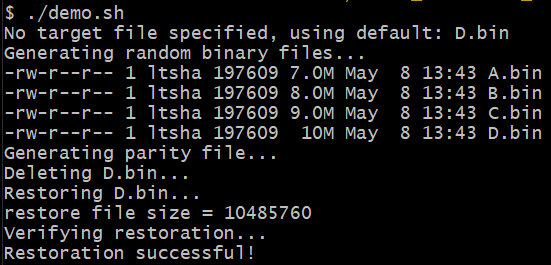
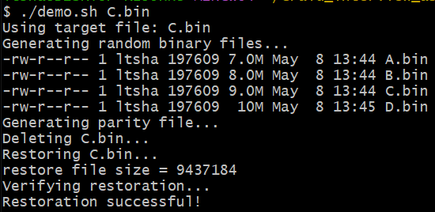

# Environment
- Operating system: Windows 10
- Shell: Git bash
- Compiler: gcc.exe (MinGW.org GCC Build-2) 9.2.0

# Files
- **demo.sh:** bash script to demonstrate functionality of programs
- **backup.c:** source c file to create a parity file
- **backup.exe:** executable file from backup.c
- **restore.c:** source c file to recover the deleted file using P.bin and the remaining three files from step 1
- **restore.exe:** executable file from restore.c

# Running Bash Script
## Flow for bash script:
The script performs the following steps:
1. **Generate Files**: Creates four binary files (A.bin, B.bin, C.bin, D.bin).
2. **Generate Parity File**: Uses `backup.exe` to create `P.bin`.
3. **Delete/Move Target File**: Moves the specified file for later comparison.
4. **Restore Target File**: Uses `restore.exe` to restore the target file.
5. **Verify and Cleanup**: Confirms restoration and removes temporary files.

## Usage
One of the valid command is as described below: 
```console
$ ./demo.sh
```
The script will use D.bin as the default file that will be deleted in step 3 and restored in step 4.

Example:




Another valid command is to pass the filename we want to delete & restore as a parameter:
```console
$ ./demo.sh A.bin
```

Example: 


